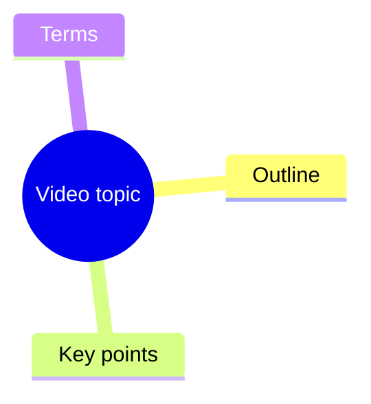

# Video Summary Mindmap

## Canonical command

Use the repository's single canonical CLI entry point:

```powershell
python "src/video_summary_cli.py" "VIDEO_URL"
```

It accepts a Bilibili or YouTube URL, a local audio/video path, or a local PDF/OOXML Word document (`.pdf`, `.doc`, `.docx`). Outputs are written to a private per-source directory under `output/<source-id>/`; keep this flat layout unchanged.

The output role contract is:

- **核心交付 (core delivery)**: `transcript.txt`, `summary.md`, `mindmap.mmd`, `metadata.json`.
- **可选派生 (optional derived)**: `transcript_segments.json`, `transcript_timed.txt`, `summary_refined.md`, `mindmap_refined.mmd`.
- **中间缓存 (intermediate cache)**: `summary_chunks.json`, `audio.mp3`, `transcription.json`.

`transcription.json` only stores transcription metadata; it is an intermediate artifact, not a core delivery file. `transcription.json` does not automatically include timestamped `segments`; timestamped segments are written to `transcript_segments.json` and `transcript_timed.txt`.

Run from the repository root. Keep generated outputs private and do not commit source media, transcripts, cookies, API keys, or output folders.

### Local source-id

Local files use `<安全化文件名>-<扩展名>-<规范化绝对路径 SHA-256 前 8 位>`; files without an extension omit that segment. With `--reuse-transcript`, keep the local path and `--out-root` unchanged.

## Supported inputs

For documents, use the same canonical command and select the output template when needed:

```powershell
python "src/video_summary_cli.py" "D:/Documents/lecture.pdf" --template refined --content-type lecture --language zh
python "src/video_summary_cli.py" "D:/Documents/lecture.docx" --template refined --content-type lecture --language zh
```

PDF and OOXML Word text is extracted directly into the source output directory. Use `--reuse-transcript` only when that directory already contains `transcript.txt`; it rebuilds summaries from the existing transcript and warns before falling back to ordinary processing when the file is missing.
When `transcript.txt` is edited, the CLI compares its SHA-256 with `metadata.json`; a mismatch or missing hash clears `transcript_segments.json`, `transcript_timed.txt`, `summary_chunks.json`, `transcription.json`, `summary_refined.md`, and `mindmap_refined.mmd` before rebuilding. Reruns without `--llm-refine` therefore do not leave stale polished files behind. A matching hash preserves timestamped reuse.

## Processing rules

1. For PDF and OOXML Word inputs, extract document text directly before any media fallback.
2. Prefer native subtitles from `yt-dlp` metadata for online videos.
3. If subtitles are unavailable, download audio and transcribe it locally.
4. Use `--cookies-from-browser chrome`, `edge`, or `firefox` when Bilibili or YouTube requires login state.
5. Use `--force-transcribe` only when subtitles are inaccurate or missing important speech.
6. Use `--reuse-transcript` to regenerate summaries from an existing `transcript.txt` without downloading, extracting, or transcribing again.
   Do not combine it with `--force-transcribe`; the CLI rejects that conflict during argument validation（二者不能同时使用）。
7. Use `--template refined` for richer output: abstract, highlights, questions, terms, chapter summaries, mind map, and transcript.
8. Keep outputs in a per-source directory under `output/<source-id>/`.

## Quality modes

Choose the built-in local transcription model and language directly:

- Fast draft: `--local-whisper-model tiny --template compact`
- Better local: `--local-whisper-model small --language zh --template refined`
- Course/livestream notes: `--content-type lecture --llm-refine --domain zh-social --language zh`
- Review pass: `--reuse-transcript --llm-refine` after editing `transcript.txt`
- Best quality: produce or edit a high-quality transcript first, then run `--reuse-transcript --llm-refine`

Local transcription defaults to `--language auto`. Keep `--language zh` for Chinese courses when fixed-language recognition gives better terminology stability.

The built-in `summary.md` is an offline extractive draft. It is reliable and cheap, but it cannot fully replace a language model for polished abstracts, accurate terminology explanations, or insight-level chapter titles. Treat `summary_refined.md` as the high-quality delivery file when `--llm-refine` is enabled.

For long lecture transcripts, `--llm-refine` summarizes chronological chunks first and then merges those chunk summaries into the final `summary_refined.md`. Lecture requests are split at 12,000 characters or less to keep provider requests below timeout-prone payload sizes while preserving chronological coverage. Completed chunk summaries are saved to `summary_chunks.json` after each chunk and reused on rerun.

Use `--domain general` by default for technical videos, business interviews, English media, and mixed-topic content. Use `--domain zh-social` only for Chinese relationship/social-skill courses where the bundled terminology helps correct ASR and extract terms.

Timed outputs are generated from VTT, SRT, common JSON subtitle formats, local ASR segments, or timed transcript lines such as `[00:10] text`. ASS/SSA/XML subtitles currently fall back to plain transcript text without segment timestamps.

## LLM refinement

Set local environment variables before semantic refinement:

```powershell
$env:OPENAI_API_KEY = "..."
$env:OPENAI_MODEL = "gpt-5.4-mini"
```

The CLI also auto-loads `.local.env` from the current working directory without overriding existing environment variables.

Run refinement from the canonical entry point:

```powershell
python "src/video_summary_cli.py" "VIDEO_URL" --reuse-transcript --template refined --llm-refine
```

Use `--llm-api responses` for the OpenAI Responses API. Use `--llm-api chat` for OpenAI-compatible services that only support Chat Completions. Override `OPENAI_BASE_URL` for compatible providers.

To reuse Codex's non-secret local configuration, run:

```powershell
python "src/video_summary_cli.py" "VIDEO_URL" --reuse-transcript --template refined --llm-refine --use-codex-config
```

This reads `~/.codex/config.toml` for model, API style, and base URL only. It does not read or copy Codex login credentials. `OPENAI_API_KEY` must still be set in the environment.

## Dependencies

Required:

```powershell
python -m pip install -r requirements.txt
```

PDF input additionally requires `pypdf`. `.doc`/`.docx` support covers OOXML containers; legacy binary `.doc` files are rejected with an explicit format error.

Fallback transcription requires `ffmpeg` available on `PATH` for audio extraction. Local transcription uses CPU `faster-whisper`; install it in a compatible Python environment when local audio transcription is needed.

Do not ask users to paste API keys into chat. Read keys only from local environment variables.

## Output guidelines

Generate concise Simplified Chinese summaries by default when the source or user request is Chinese. Preserve source terminology when translation would reduce precision.

Use Mermaid mindmap syntax:



If extraction fails, report the exact failed phase: metadata, subtitle fetch, audio download, transcription, or output generation.
The canonical CLI reports operational failures as `ERROR: 阶段=<phase>；<readable reason>`, returns non-zero, preserves the original reason, and does not print a full traceback.
