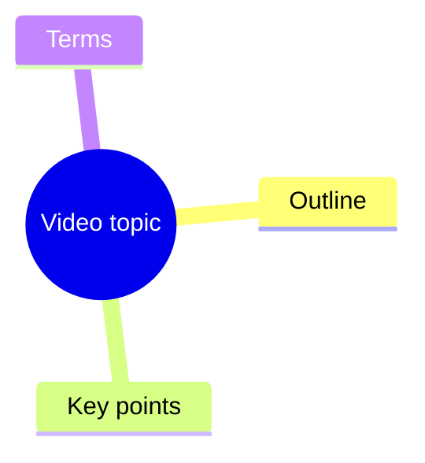

# Video Summary Mindmap

## Workflow

Use `scripts/video_summary.py` for repeatable video analysis. It accepts a Bilibili or YouTube URL, or a local media path, then writes:

- `transcript.txt`
- `summary.md`
- `mindmap.mmd`
- `metadata.json`

Run from the project root:

```powershell
python ".agents/skill/video-summary-mindmap/scripts/video_summary.py" "VIDEO_URL" --out-root "workflow/output"
```

The root wrapper is equivalent:

```powershell
python "workflow/video_summary.py" "VIDEO_URL"
```

## Decision Rules

1. Prefer native subtitles from `yt-dlp` metadata.
2. If subtitles are unavailable, download audio and transcribe it.
3. Use `--cookies-from-browser chrome` or `--cookies-from-browser edge` when Bilibili or YouTube requires login state.
4. Use `--force-transcribe` only when subtitles are inaccurate or missing important speech.
5. Use `--reuse-transcript` to regenerate summaries from an existing `transcript.txt` without downloading or transcribing again.
6. Use `--template refined` for BibiGPT-style output: abstract, highlights, questions, terms, chapter summaries, mind map, and transcript.
7. Keep outputs in a per-video directory under `workflow/output/<video-id>/`.

## Quality Modes

Use these modes based on speed and quality requirements:

- Fast draft: `--local-whisper-model tiny --template compact`
- Better local: `--local-whisper-model small --template refined`
- Review pass: rerun with `--reuse-transcript --template refined` after editing `transcript.txt`
- Best quality: produce transcript with a stronger model or OpenAI transcription, then run `--llm-refine` to generate `summary_refined.md` and `mindmap_refined.mmd`

The built-in offline summary is extractive. It is reliable and cheap, but it cannot fully replace a language model for polished abstracts, accurate terminology explanations, or insight-level chapter titles.

## LLM Refinement

Set local environment variables before using semantic refinement:

```powershell
$env:OPENAI_API_KEY = "..."
$env:OPENAI_MODEL = "gpt-5.4-mini"
```

The script also auto-loads `.local.env` from the current working directory without overriding existing environment variables.

Run:

```powershell
python "workflow/video_summary.py" "VIDEO_URL" --reuse-transcript --template refined --llm-refine
```

Use `--llm-api responses` for OpenAI Responses API. Use `--llm-api chat` for OpenAI-compatible services that only support Chat Completions. Override `OPENAI_BASE_URL` for compatible providers.

To reuse Codex's non-secret local configuration, run:

```powershell
python "workflow/video_summary.py" "VIDEO_URL" --reuse-transcript --template refined --llm-refine --use-codex-config
```

This reads `~/.codex/config.toml` for model, API style, and base URL only. It does not read or copy Codex login credentials. `OPENAI_API_KEY` must still be set in the environment.

## Dependencies

Required:

```powershell
python -m pip install yt-dlp
```

Fallback transcription requires:

- `OPENAI_API_KEY` in the environment
- the bundled Codex `transcribe` skill script, or `TRANSCRIBE_CLI` pointing to an equivalent CLI
- `ffmpeg` available on `PATH` for audio extraction

If `OPENAI_API_KEY` is not set, install `faster-whisper` in a compatible Python environment. The script uses CPU `faster-whisper` with `--local-whisper-model tiny` by default.

Do not ask users to paste API keys into chat. Read keys only from local environment variables.

## Output Guidelines

Generate concise Simplified Chinese summaries by default when the source or user request is Chinese. Preserve source terminology when translation would reduce precision.

Use Mermaid mindmap syntax:



If extraction fails, report the exact failed phase: metadata, subtitle fetch, audio download, transcription, or output generation.
