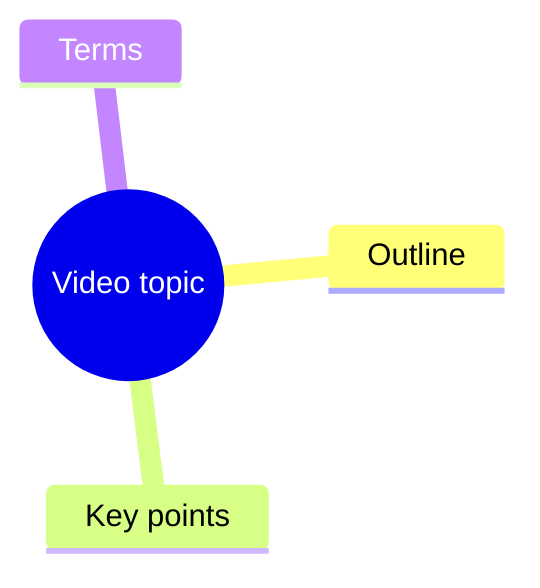

# Video Summary Mindmap

## Canonical command

Use the repository's single canonical CLI entry point:

```powershell
python "src/video_summary_cli.py" "VIDEO_URL"
```

It accepts a Bilibili or YouTube URL, a local audio/video path, or a local text-layer PDF/OOXML Word document (`.pdf`, `.doc`, `.docx`). Image-only or scanned PDFs are unsupported. Outputs are written to a private per-source directory under `output/<source-id>/`; keep this per-source layout unchanged.

## Delivery decision

1. **Check the CLI exit first.** Only a successful exit is a valid delivery; a
   failure, non-zero exit, or unusable LLM summary is never a final result.
2. **Then open `output/<source-id>/summary.md`.** It is the only required final draft.
3. `mindmap.mmd` is an optional final companion and may be absent when the LLM
   returns no valid Mermaid.
4. `support/transcript.txt` is evidence/support material only, not the final draft.
5. `_internal/`, including `_internal/previous_final/`, contains drafts, caches, and
   historical internal state; never hand it off.
6. Without `--llm-refine`, no final draft is produced; old files and drafts do not
   count as the current delivery.

Run from the repository root. Keep generated outputs private and do not commit source media, transcripts, cookies, API keys, or output folders.

### Local source-id

Local files use a stable source-id derived from the sanitized filename, extension, and source path; files without an extension omit that segment. The source-id never exposes the raw path. For PDF/DOC/DOCX inputs, user-visible source labels and LLM source fields use only the sanitized filename/title, not the local parent directory or full path. With `--reuse-transcript`, keep the local path and `--out-root` unchanged.

## Supported inputs

For documents, first prepare the transcript, then request the final delivery:

```powershell
python "src/video_summary_cli.py" "D:/Documents/lecture.pdf"
python "src/video_summary_cli.py" "D:/Documents/lecture.pdf" --reuse-transcript --llm-refine
python "src/video_summary_cli.py" "D:/Documents/lecture.docx"
python "src/video_summary_cli.py" "D:/Documents/lecture.docx" --reuse-transcript --llm-refine
```

PDF and OOXML Word text is extracted directly into the source output directory.
The extracted `support/transcript.txt` is support material, not the final summary.
`--reuse-transcript` only supports local files, not URLs, and requires an existing `support/transcript.txt` or legacy root-level `transcript.txt`. Use it when that directory already contains `support/transcript.txt`; for backward compatibility it also reads a legacy root-level `transcript.txt`. A new run rewrites legacy input to `support/transcript.txt`. If both locations are missing, the command fails before reading or processing the source. Edits to `support/transcript.txt` are consumed by the next `--reuse-transcript --llm-refine` run. Add `--llm-refine` for final delivery;
draft artifacts are not user deliverables.

Image-only or scanned PDFs without an extractable text layer are unsupported.
The CLI fails non-zero during `PDF/DOCX文本提取` with a readable error and does
not fall back to audio download or local transcription.

## Processing rules

1. For PDF and OOXML Word inputs, extract document text directly before any media fallback.
2. Require a PDF text layer; reject image-only or scanned PDFs during document extraction without media fallback.
3. Prefer native subtitles from `yt-dlp` metadata for online videos.
4. If subtitles are unavailable, download audio and transcribe it locally.
5. Use `--cookies-from-browser chrome`, `edge`, or `firefox` when Bilibili or YouTube requires login state.
6. Use `--force-transcribe` only when subtitles are inaccurate or missing important speech.
7. Use `--reuse-transcript` to regenerate summaries from an existing
   `support/transcript.txt` without downloading, extracting, or transcribing again.
   A legacy root-level `transcript.txt` is accepted for compatibility; if both
   locations are missing, fail immediately without accessing the source.
   Do not combine it with `--force-transcribe`; the CLI rejects that conflict during argument validation（二者不能同时使用）。
8. Use `--template refined` for a richer internal draft: abstract, highlights,
   questions, terms, chapter summaries, and mind map. The compact/refined drafts
   summarize the transcript but do not include the complete transcript.
9. Use `--llm-refine` for semantic refinement; apply the Delivery decision above
   to determine whether the result is a final hand-off.
10. Keep every internal file, including optional `_internal/transcript_timed.txt`, under `_internal/`.

## Quality modes

Choose the built-in local transcription model and language directly:

- Support material only: `--local-whisper-model tiny --template compact` (no final)
- Higher-quality support material: `--local-whisper-model small --language zh --template refined` (no final)
- Course/livestream notes: `--content-type lecture --llm-refine --domain zh-social --language zh`
- Review pass: `--reuse-transcript --llm-refine` after editing
  `support/transcript.txt`
- Best quality: produce or edit a high-quality transcript first, then run `--reuse-transcript --llm-refine`

`compact` is the concise deterministic/offline template; `refined` is the richer structured template with chapter and term sections.
The CLI option `--template compact|refined` selects these two output roles.

Local transcription defaults to `--language auto`. Keep `--language zh` for Chinese courses when fixed-language recognition gives better terminology stability.

The built-in `_internal/summary_draft.md` is an offline extractive draft, not a
final deliverable. Use the Delivery decision above for hand-off rules.

For long lecture transcripts, `--llm-refine` summarizes chronological chunks first and then merges those chunk summaries into the final `summary.md`. Lecture requests are split at 12,000 characters or less to keep provider requests below timeout-prone payload sizes while preserving chronological coverage. Completed chunk summaries are written to `_internal/summary_chunks.json` during the current run; the cache is cleared at the start of each new output run and is not reused across runs.

Use `--domain general` by default for technical videos, business interviews, English media, and mixed-topic content. Use `--domain zh-social` only for Chinese relationship/social-skill courses where the bundled terminology helps correct ASR and extract terms.

Timed outputs are generated from VTT, SRT, common JSON subtitle formats, local ASR segments, or timed transcript lines such as `[00:10] text`. ASS/SSA/XML subtitles currently fall back to plain transcript text without segment timestamps.

## LLM refinement

Set local environment variables before semantic refinement:

```powershell
$env:OPENAI_API_KEY = "..."
$env:OPENAI_MODEL = "gpt-5.4-mini"
```

The CLI also auto-loads `.local.env` from the current working directory without overriding existing environment variables.

Run refinement from the canonical entry point. Only a successful command
publishes the final files:

```powershell
python "src/video_summary_cli.py" "D:/Documents/lecture.pdf" --reuse-transcript --llm-refine
```

After the command exits, apply the Delivery decision above. Support material,
drafts, caches, and archives from an unsuccessful run are never final delivery.

Use `--llm-api responses` for the OpenAI Responses API. Use `--llm-api chat` for OpenAI-compatible services that only support Chat Completions. Override `OPENAI_BASE_URL` for compatible providers.

To reuse Codex's non-secret local configuration, run:

```powershell
python "src/video_summary_cli.py" "D:/Documents/lecture.pdf" --reuse-transcript --template refined --llm-refine --use-codex-config
```

This reads `~/.codex/config.toml` for model, API style, and base URL only. It does not read or copy Codex login credentials. `OPENAI_API_KEY` must still be set in the environment.

## Dependencies

Required:

```powershell
python -m pip install -r requirements.txt
```

Text-layer PDF input requires `pypdf`. Image-only or scanned PDFs without an
extractable text layer are unsupported; the CLI reports a readable
PDF/DOCX extraction-stage error and does not fall back to OCR, Tesseract,
`ocrmypdf`, `pdftoppm`, or an external OCR service. `.doc`/`.docx` support
covers OOXML containers; legacy binary `.doc` files are rejected with an
explicit format error.

Fallback transcription requires `ffmpeg` available on `PATH` for audio extraction. Local transcription uses CPU `faster-whisper`; install it in a compatible Python environment when local audio transcription is needed.

Do not ask users to paste API keys into chat. Read keys only from local environment variables.

## Output guidelines

Generate concise Simplified Chinese summaries by default when the source or user request is Chinese. Preserve source terminology when translation would reduce precision.

Use Mermaid mindmap syntax:



If extraction fails, report the exact failed phase: metadata, subtitle fetch,
audio download, transcription, document reading, or output generation. For PDF
input that cannot be read, use
`ERROR: 阶段=PDF/DOCX文本提取；PDF 文件损坏或无法读取`; when PDF/DOCX text is
empty or too short, use
`ERROR: 阶段=PDF/DOCX文本提取；文档文本为空或过短`. These document errors must
not be written as transcription failures. The canonical CLI reports operational
failures as `ERROR: 阶段=<phase>；<readable reason>`, returns non-zero, preserves
the original reason, and does not print a full traceback.
