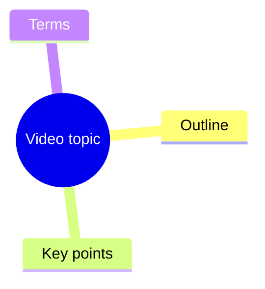

# Video Summary Mindmap

## Workflow

Use `scripts/video_summary.py` for repeatable video analysis. It accepts a Bilibili or YouTube URL, or a local media path, then writes:

- `transcript.txt`
- `transcript_segments.json`
- `transcript_timed.txt`
- `summary.md`
- `mindmap.mmd`
- `metadata.json`

Run from the project root:

```powershell
python ".agents/skill/video-summary-mindmap/scripts/video_summary.py" "VIDEO_URL" --out-root "workflow/output"
```

The root wrapper is equivalent:

```powershell
python "workflow/video_summary.py" "VIDEO_URL"
```

## Workflow Boundary

For video-summary-mindmap tasks, use `workflow/video_summary.py` or `scripts/video_summary.py` end to end. Do not call separate Codex transcribe skills, ffmpeg whisper filters, whisper.cpp commands, or ad hoc transcription scripts as part of this workflow.

If transcription fails, report the failed phase and the exact error. Do not switch transcription engines or download alternate model formats unless the user explicitly asks for that fallback.

## Decision Rules

1. Prefer native subtitles from `yt-dlp` metadata.
2. If subtitles are unavailable, download audio and transcribe it.
3. Use `--cookies-from-browser chrome` or `--cookies-from-browser edge` when Bilibili or YouTube requires login state.
4. Use `--force-transcribe` only when subtitles are inaccurate or missing important speech.
5. Use `--reuse-transcript` to regenerate summaries from an existing `transcript.txt` without downloading or transcribing again.
6. Use `--template refined` for BibiGPT-style output: abstract, highlights, questions, terms, chapter summaries, mind map, and transcript.
7. Keep outputs in a per-video directory under `workflow/output/<video-id>/`.

## Quality Modes

Use these modes based on speed and quality requirements:

- Fast draft: `--transcribe-engine local --local-whisper-model tiny --template compact`
- Fast refined draft: `--template refined`
- Better local: `--transcribe-engine local --local-whisper-model small --language zh --template refined`
- Course/livestream notes: `--content-type lecture --llm-refine --domain zh-social --language zh`
- Review pass: rerun with `--reuse-transcript --llm-refine` after editing `transcript.txt`
- Best quality: produce or edit a high-quality transcript first, then run `--reuse-transcript --llm-refine` to generate `summary_refined.md` and `mindmap_refined.mmd`

Local transcription defaults to `--language auto`. Keep `--language zh` for Chinese courses when fixed-language recognition gives better terminology stability.

The built-in `summary.md` is an offline extractive draft. It is reliable and cheap, but it cannot fully replace a language model for polished abstracts, accurate terminology explanations, or insight-level chapter titles. Treat `summary_refined.md` as the high-quality delivery file when `--llm-refine` is enabled.

For long lecture transcripts, `--llm-refine` summarizes chronological chunks first and then merges those chunk summaries into the final `summary_refined.md`. This avoids dropping the back half of the video while keeping each provider request bounded. Completed chunk summaries are saved to `summary_chunks.json` after each chunk and reused on rerun.

Use `--domain general` by default for technical videos, business interviews, English media, and mixed-topic content. Use `--domain zh-social` only for Chinese relationship/social-skill courses where the bundled terminology helps correct ASR and extract terms.

Timed outputs are generated from VTT, SRT, common JSON subtitle formats, local ASR segments, or timed transcript lines such as `[00:10] text`. ASS/SSA/XML subtitles currently fall back to plain transcript text without segment timestamps.

## LLM Refinement

Set local environment variables before using semantic refinement:

```powershell
$env:OPENAI_API_KEY = "..."
$env:OPENAI_MODEL = "gpt-5.4-mini"
```

The script also auto-loads `.local.env` from the current working directory without overriding existing environment variables.

Run:

```powershell
python "workflow/video_summary.py" "VIDEO_URL" --reuse-transcript --template refined --llm-refine
```

Use `--llm-api responses` for OpenAI Responses API. Use `--llm-api chat` for OpenAI-compatible services that only support Chat Completions. Override `OPENAI_BASE_URL` for compatible providers.

To reuse Codex's non-secret local configuration, run:

```powershell
python "workflow/video_summary.py" "VIDEO_URL" --reuse-transcript --template refined --llm-refine --use-codex-config
```

This reads `~/.codex/config.toml` for model, API style, and base URL only. It does not read or copy Codex login credentials. `OPENAI_API_KEY` must still be set in the environment.

## Dependencies

Required:

```powershell
python -m pip install -r requirements.txt
```

Fallback transcription requires:

- `ffmpeg` available on `PATH` for audio extraction

Install `faster-whisper` in a compatible Python environment for local transcription. The script uses CPU `faster-whisper` with `--transcribe-engine local --local-whisper-model tiny --language auto` by default.

Do not ask users to paste API keys into chat. Read keys only from local environment variables.

## Output Guidelines

Generate concise Simplified Chinese summaries by default when the source or user request is Chinese. Preserve source terminology when translation would reduce precision.

Use Mermaid mindmap syntax:



If extraction fails, report the exact failed phase: metadata, subtitle fetch, audio download, transcription, or output generation.
